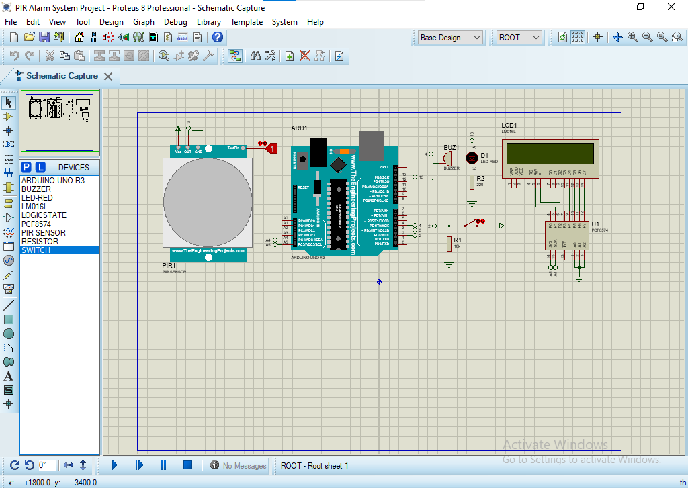
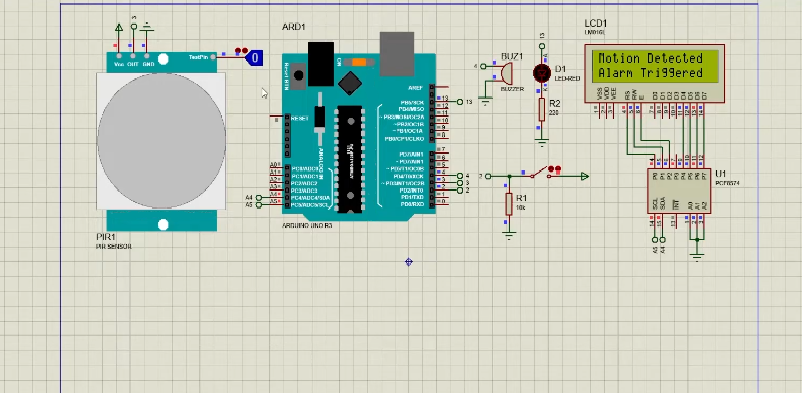

# PIR-Motion-Sensor-Based-Home-Security-System-Using-Arduino-on-Proteus

A home security system using a PIR (Passive Infrared) motion sensor connected to an Arduino. The system detects motion and triggers both audible (buzzer) and visual (LED) alerts. The project is simulated using **Proteus 8** before real-world implementation.

## How its works?
- The LCD will display "Alarm Security System" in the beginning, followed by  "LOADING **********".
- After loading the screen, the LCD will display "Alarm Activated".
- If the sensor detects movement, the LED light will blink, followed by a buzzer. Then, the LCD will display "Motion Detected Alarm Triggered".
- The BUZZER and LED are still ON even though the PIR sensor does not detect any movement after the alarm is triggered.
- Press the push button and ensure the PIR sensor did not detect any movement to reset the alarm. Then, the LCD will display "Alarm Reset" followed by "Alarm Activated".
 
  The circuit:
- Connect PIR motion sensor GND, OUT, and VCC pins to the GROUND, 3, and 5V pins of Arduino.
- Connect LED from pin 13 Arduino to the GROUND through 220 Ω resistor.
- Connect pushbutton from pin 2 Arduino to +5V. Then, add a 10kΩ resistor from pin 2 to the GROUND.
- Connect buzzer + pin to pin 3 Arduino and - pin to the GROUND.
- Connect LCD 1602 I2C SDA and SCL pins to Arduino UNO SDA and SCL pins. Then, connect GND and VCC pins to the ground and +5V.

---

## Features

- Detects motion within a defined area.
- Visual alert using LED.
- Audible alert using buzzer.
- Fully simulated in Proteus.
- Expandable to trigger notifications or automation systems.

---

## Components Used in project
- Arduino UNO: Microcontroller.
- PIR Motion Sensor: Detects movement.
- Buzzer: Produces audible alarm.
- LED: Provides visual alert.
- Resistors: used for current limiting.
- Proteus 8 (for simulation).

---

## Screenshots
### Circuit Diagram

### When Simulation is started and Alaram is activated

### When motion is detected

---

## Arduino Code
#include <Wire.h> 
#include <LiquidCrystal_I2C.h>

int calibrationTime = 10;     
int buttonState;             
int lastButtonState = LOW;   
int ledState = LOW;          
boolean lockLow = true; 

const int buttonPin = 2;  
const int pirPin = 3;     
const int buzPin = 4;     
const int ledPin = 13;    

unsigned long lastDebounceTime = 0;   
unsigned long debounceDelay = 50;    
unsigned long previousMillis = 0;     
const long interval = 1000;           

LiquidCrystal_I2C lcd(0x20,16,2);

void setup()
{
  
  pinMode(pirPin, INPUT); 
  pinMode(ledPin, OUTPUT); 
  pinMode(buzPin, OUTPUT);
  pinMode(buttonPin, INPUT);
  digitalWrite(pirPin, LOW); 
  
  lcd.init();
  lcd.backlight();
  lcd.setCursor(1,0);
  lcd.print("Alarm Security");
  lcd.setCursor(5,1);
  lcd.print("System");
  delay (1000);
  lcd.clear();
  lcd.setCursor(5,0);
  lcd.print("LOADING");
  
  //give the sensor some time to calibrate 
  for(int i = 0; i < calibrationTime; i++)
  { 
    lcd.setCursor(i+3,1);
    lcd.print("*");
    delay(100); 
  }
  lcd.clear();
  lcd.setCursor(1,0);
  lcd.print("Alarm Activated");
} 
  
void loop()
{
  if (digitalRead (pirPin)==HIGH)
  {
    lcd.clear();
    lcd.setCursor(0,0);
    lcd.print("Motion Detected");
    lcd.setCursor(0,1);
    lcd.print("Alarm Triggered");
    while (lockLow==true)
    {
      unsigned long currentMillis = millis();
      if (currentMillis - previousMillis >= interval)    
      {
        previousMillis = currentMillis;                        
      if (ledState == LOW) 
      {
        ledState = HIGH;
      } 
      else 
      {
        ledState = LOW;
      }                     
      digitalWrite(ledPin, ledState);      /
      digitalWrite(buzPin, ledState);     
    }    
    int reading = digitalRead(buttonPin);  
    if (reading != lastButtonState)  
    {
      lastDebounceTime = millis();
    }
    if ((millis() - lastDebounceTime) > debounceDelay) 
    {
      if (reading != buttonState) 
      {
        buttonState = reading;
        if (buttonState == HIGH) 
        {
          lockLow=false;
          digitalWrite(ledPin, LOW);
          digitalWrite(buzPin, LOW);
          delay(50);
        }
      }
    }
    // save the reading. Next time through the loop, it'll be the lastButtonState:
    lastButtonState = reading;
   }
  }
  
  if (digitalRead(buttonPin)==HIGH && digitalRead(pirPin)==LOW)
  {
    lcd.clear();      
    lcd.setCursor(3,0);      
    lcd.print("Alarm Reset");
    delay(1000);
    lcd.clear();
    lcd.setCursor(1,0);
    lcd.print("Alarm Activated");     
    lockLow = true;
   }         
}

  
